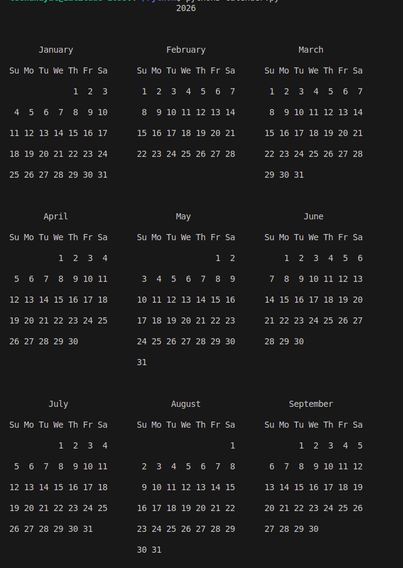
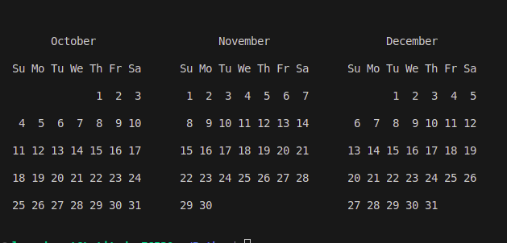

# 📅 Python Calendar Generator

A simple Python program that generates and displays a **full yearly calendar** using the built-in `calendar` module.

---

## 🚀 Features

- Displays the **entire calendar for a given year**
- Clean and formatted layout
- Week starts on **Sunday**
- Custom spacing and formatting
- Includes optional code to display **individual months**

---

## 🧠 How It Works

The program uses Python’s built-in `calendar` module:

- `TextCalendar()` → Creates a calendar object  
- `formatyear()` → Formats the entire year into a printable string  

---
## Sample Output




## 🧾 Code Overview

```python
import calendar

year = 2026

# Create a TextCalendar object (week starts on Sunday)
cal = calendar.TextCalendar(calendar.SUNDAY)

# Generate formatted yearly calendar
yearly_calendar = cal.formatyear(year, w=2, l=2, c=6, m=3)

print(yearly_calendar)


